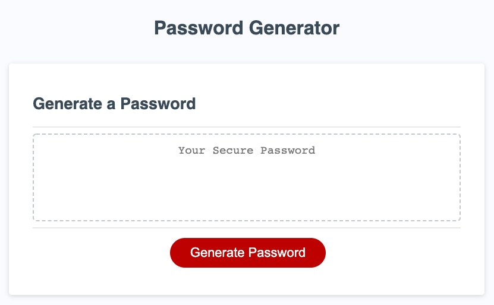

# password-generator

## Project Goal
Create an application that generates a random password based on user-selected criteria. This app will run in the browser and feature dynamically updated HTML and CSS powered by your JavaScript code. It will also feature a clean and polished user interface and be responsive, ensuring that it adapts to multiple screen sizes.

## Password Generator

## About
The Password Generator application allows a user to randomly generate a password.  A user can create a password by choosing which type of characters to include in their password (uppercase letters, lowercase letters, numbers and/or special characters). The user must select at least one character type.

